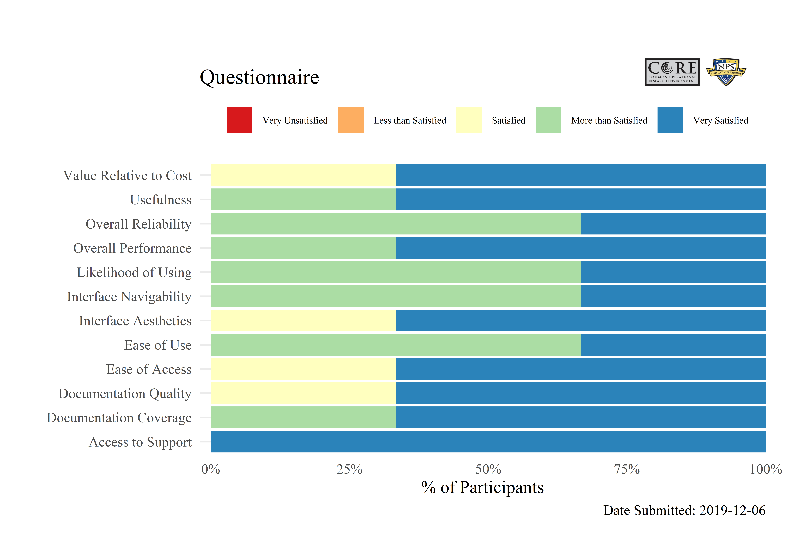

---
output:
  github_document:
    html_preview: true
  html_document:
    keep_md: yes
always_allow_html: yes
editor_options: 
  chunk_output_type: console
---

<!-- README.Rmd generates README.md. -->

```{r, echo=FALSE}
knitr::opts_chunk$set(
  # collapse = TRUE,
  fig.align = "center",
  comment = "#>",
  fig.path = "man/figures/",
  message = FALSE,
  warning = FALSE
)
options(width = 120)
```


# `{birdcage}`


<!-- badges: start -->
[](https://cran.r-project.org/package=birdcage)
[](https://www.tidyverse.org/lifecycle/#maturing)
[](https://travis-ci.org/NPSCORELAB/birdcage)
[](https://github.com/NPSCORELAB/birdcage/commits/master)
[](https://www.gnu.org/licenses/gpl-3.0)
[](https://www.r-project.org/)
[](https://github.com/NPSCORELAB/birdcage)
[](http://hits.dwyl.io/NPSCORELAB/birdcage)
<!-- badges: end -->


# Demo

[`{birdcage}` on shinyapps.io](https://bknapp.shinyapps.io/birdcage/)

```{r, echo=FALSE}
knitr::include_graphics("man/figures/demo.gif")
```


# Installation

```{r, eval=FALSE}
# install.packages("remotes")
remotes::install_github("NPSCORELAB/birdcage")
```

# Usage

```{r, eval=FALSE}
birdcage::launch_birdcage()
```


# Responses

```{r, echo=FALSE}

```


